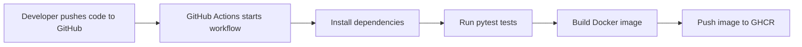

# Beginner DevOps Project with GitHub Actions

This project is a simple and beginner-friendly DevOps demonstration built for academic submission. It contains a small Flask-based machine learning API, automated tests, Docker containerization, and a complete CI/CD pipeline using GitHub Actions.

The application predicts a diabetes progression value from 10 input features using a Linear Regression model from `scikit-learn`.

## Project Objectives

- Build a simple Python web application
- Train and use a machine learning model
- Write basic automated tests
- Containerize the application with Docker
- Automate testing, build, and deployment with GitHub Actions

## Project Folder Structure

```text
ml-devops-github-actions/
|-- .github/
|   |-- workflows/
|   |   |-- ci-cd.yml
|-- .dockerignore
|-- .gitignore
|-- Dockerfile
|-- README.md
|-- app.py
|-- requirements.txt
|-- sample_request.json
|-- model/
|   |-- train_model.py
|-- tests/
|   |-- test_app.py
```

## Technologies Used

- Python 3.11
- Flask
- scikit-learn
- pytest
- Docker
- GitHub Actions
- GitHub Container Registry (GHCR)

## Application Workflow

1. The user sends a request to the Flask API.
2. The app checks whether the trained model exists.
3. If the model file is missing, the app trains it automatically.
4. The app loads the model and returns a prediction.

## API Endpoints

### `GET /`

Checks whether the application is running.

Example response:

```json
{
  "message": "ML prediction API is running.",
  "model": "diabetes_regression",
  "status": "ok"
}
```

### `POST /predict`

Accepts a JSON body with exactly 10 numeric values.

Example request:

```json
{
  "features": [0.05, -0.04, 0.02, 0.01, -0.03, -0.02, 0.04, -0.01, 0.03, 0.02]
}
```

Example response:

```json
{
  "prediction": 190.5264
}
```

## Source Code Files

### `app.py`

- Main Flask application
- Loads the trained model
- Provides health and prediction endpoints
- Automatically trains the model if the file does not exist

### `model/train_model.py`

- Trains a Linear Regression model using the diabetes dataset
- Saves the trained model as `model/trained_model.pkl`

### `tests/test_app.py`

- Tests the model generation
- Tests the health endpoint
- Tests valid prediction requests
- Tests invalid input handling

## Docker Support

The project includes a `Dockerfile` so the application can run inside a container.

### Build Docker image

```bash
docker build -t ml-devops-app .
```

### Run Docker container

```bash
docker run -d -p 5000:5000 --name ml-devops-container ml-devops-app
```

## GitHub Actions CI/CD Pipeline

The GitHub Actions workflow file is:

```text
.github/workflows/ci-cd.yml
```

### Pipeline Stages

#### 1. Continuous Integration

Whenever code is pushed to `main` or `master`, or a pull request is created:

- The repository is checked out
- Python 3.11 is installed
- Dependencies are installed
- Automated tests are run with `pytest`

#### 2. Docker Build

If the tests pass:

- Docker Buildx is set up
- The Docker image is built successfully

#### 3. Continuous Deployment

When code is pushed to `main` or `master`:

- The workflow logs in to GitHub Container Registry
- The Docker image is published to `ghcr.io`

This means the project is automatically tested, built, and deployed after every valid push to the main branch.

## CI/CD Pipeline Diagram



## How to Run the Project Locally

### 1. Clone the project

```bash
git clone https://github.com/your-username/ml-devops-github-actions.git
cd ml-devops-github-actions
```

### 2. Create a virtual environment

```bash
python -m venv venv
```

### 3. Activate the virtual environment

On Windows:

```powershell
venv\Scripts\activate
```

On Linux/macOS:

```bash
source venv/bin/activate
```

### 4. Install dependencies

```bash
pip install -r requirements.txt
```

### 5. Run the application

```bash
python app.py
```

The app will run at:

```text
http://localhost:5000
```

### 6. Test the API

Health check:

```bash
curl http://localhost:5000/
```

Prediction request:

```bash
curl -X POST http://localhost:5000/predict -H "Content-Type: application/json" -d @sample_request.json
```

## How to Run Tests Locally

```bash
pytest -v
```

## Step-by-Step Instructions to Push to GitHub

### 1. Create a new repository on GitHub

- Open GitHub
- Click `New repository`
- Give the repository a name such as `ml-devops-github-actions`
- Create the repository without adding extra files

### 2. Initialize Git locally if needed

```bash
git init
```

### 3. Add all project files

```bash
git add .
```

### 4. Create the first commit

```bash
git commit -m "Add beginner DevOps project with GitHub Actions"
```

### 5. Connect your local project to GitHub

```bash
git remote add origin https://github.com/your-username/ml-devops-github-actions.git
```

### 6. Push the code

```bash
git branch -M main
git push -u origin main
```

### 7. Check the workflow

- Open the GitHub repository
- Go to the `Actions` tab
- Open the latest workflow run
- Confirm that test, build, and deploy jobs have completed

## Important Note About Deployment

This project publishes the Docker image to GitHub Container Registry using the built-in `GITHUB_TOKEN`. No extra Docker Hub account is required for the basic version of this project.

The image will be available in this format:

```text
ghcr.io/<your-github-username>/ml-devops-app:latest
```

## Sample Viva Explanation

You can explain the project in simple words like this:

"This project shows a complete CI/CD pipeline using GitHub Actions. I created a Flask machine learning API, wrote tests using pytest, added Docker for containerization, and configured GitHub Actions to automatically test, build, and deploy the project whenever code is pushed to GitHub."

## Conclusion

This project is small, simple, and practical. It clearly demonstrates the main DevOps concepts:

- Version control with Git and GitHub
- Automated testing
- Continuous Integration
- Containerization with Docker
- Continuous Deployment with GitHub Actions

It is suitable for college submission, lab evaluation, demonstration, and beginner learning.
